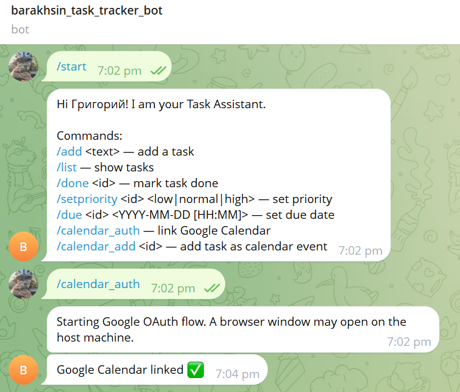

# Lab2 Report

University: [ITMO University](https://itmo.ru/ru/)
Faculty: [FICT](https://fict.itmo.ru)
Course: [Vibe Coding: AI-боты для бизнеса](https://github.com/itmo-ict-faculty/vibe-coding-for-business)
Year: 2025/2026
Group: U4225
Author: Barakhsin
Lab: Lab2
Date of create: [ДАТА_НАЧАЛА_РАБОТЫ]
Date of finished: [ДАТА_ЗАВЕРШЕНИЯ_РАБОТЫ]

## Описание лабораторной работы

Согласно требованиям Lab2 — "Подключение бота к данным" — в этой работе выполнена интеграция Telegram-бота с внешним сервисом Google Calendar для создания событий на основе задач. Это улучшение расширяет функциональность бота и делает его полезнее для реального использования. Источник требований: [Lab2](https://itmo-ict-faculty.github.io/vibe-coding-for-business/labs/lab2/).

## Теоретическая часть

### Google Calendar API и OAuth 2.0
- Понятия: OAuth 2.0, access/refresh tokens, scopes
- Объекты: Events, Calendars
- Клиентские библиотеки: `google-api-python-client`, `google-auth`, `google-auth-oauthlib`

### Архитектура интеграции
- Локальный OAuth flow через `run_local_server()`
- Хранение `token.json` с автообновлением refresh токена
- Мэппинг задач на события календаря (start/end time)

## Практическая часть

### Промпт для LLM

```
Улучши моего Telegram-бота, добавив интеграцию с Google Calendar API:
- /calendar_auth — запуск OAuth 2.0 и сохранение token.json
- /calendar_add <id> — создание событий по due-дате задачи
Требования: использовать google-api-python-client, хранить токены локально, обрабатывать ошибки.
```

### Установка и настройка

1. Установка зависимостей:
   ```bash
   pip install google-api-python-client google-auth google-auth-oauthlib
   ```
2. Создание OAuth 2.0 Client ID (Desktop App) в Google Cloud Console
3. Сохранение `credentials.json` рядом с `bot.py`
4. Первый запуск команды `/calendar_auth` для генерации `token.json`

### Реализация

- Функции:
  - `run_google_oauth_flow()` — запуск локального OAuth
  - `get_google_credentials()` — загрузка/рефреш токенов
  - `get_calendar_service()` — клиент Calendar API
  - `calendar_add` — создание события на основе `due_iso`

- Схема события:
  - `summary` = текст задачи
  - `description` = Task ID
  - `start/end` = `due_iso` и `due_iso + 1h`

### Тестирование

1. Запуск `/calendar_auth`, успешное создание `token.json`
2. Создание задачи с дедлайном `/due 1 2025-01-25 15:00`
3. Выполнение `/calendar_add 1` и проверка события в Google Calendar
4. Обработка ошибок: отсутствует due-дата, не найден task id, нет токена

## Результаты

- Добавлены команды `/calendar_auth` и `/calendar_add`
- Реализовано создание событий в календаре из задач
- Токены безопасно хранятся и автоматически обновляются
- Пользователь получает ссылку `htmlLink` на созданное событие

## Выводы

Интеграция с Google Calendar соответствует целям Lab2: бот подключен к внешнему источнику данных и использует его для расширения функциональности. Это делает бота практичнее и ценнее для пользователя. Ссылка на требования: [Lab2](https://itmo-ict-faculty.github.io/vibe-coding-for-business/labs/lab2/).

## Приложения

### Скриншоты интеграции
- Авторизация: `auth.png`


- Создание события: `calendar.png`


### Ссылка на общее видео-демо (для всех лаб)
- [YouTube/Drive: единое видео-демо](#)
